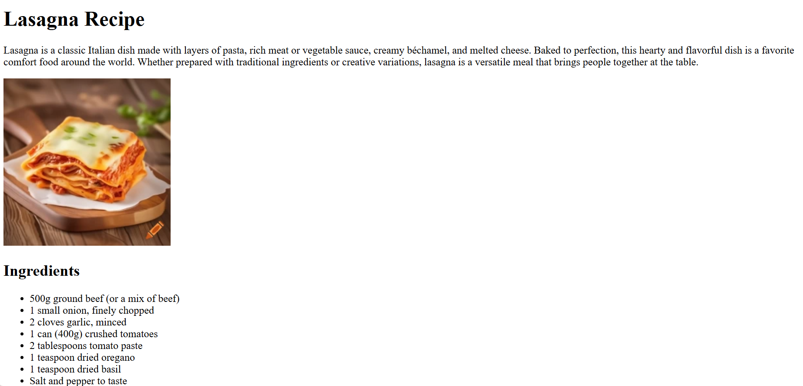
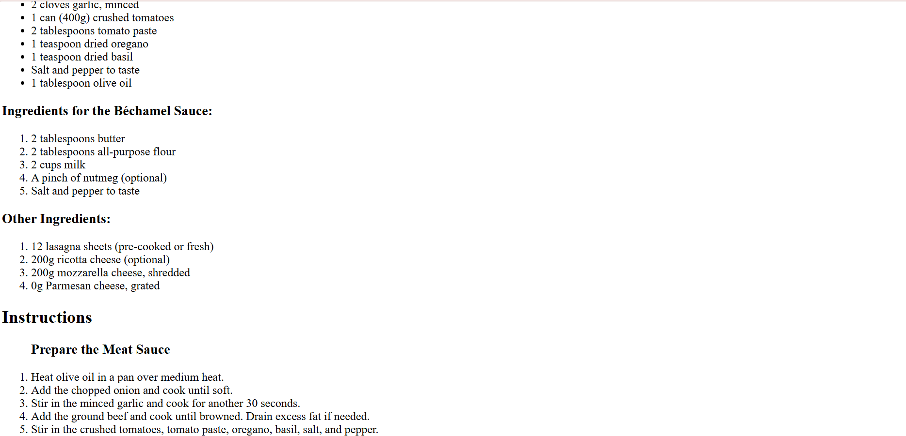
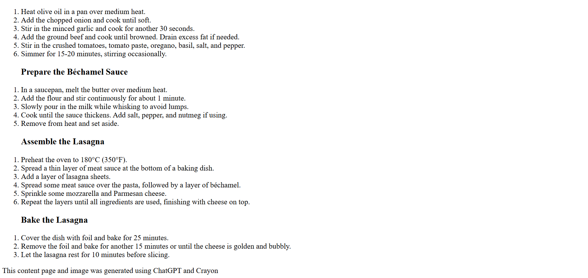

# 🍝 Lasagna Recipe Page  

This repository contains my first basic HTML project, **Lasagna Recipe Page**, which I created to practice fundamental web development concepts.  

## 📌 About the Project  
Lasagna Recipe Page is a simple webpage built with HTML to present a delicious lasagna recipe. The project includes:  

- 🍅 An introduction to lasagna  
- 📑 A list of ingredients  
- 👩‍🍳 Step-by-step cooking instructions  

## 🚀 Technologies Used  
- **HTML5**  

## 📷 Preview  
Check out the project:  
  
  
  

👩‍💻 Developed with ❤️ by **Isabela Class**  
